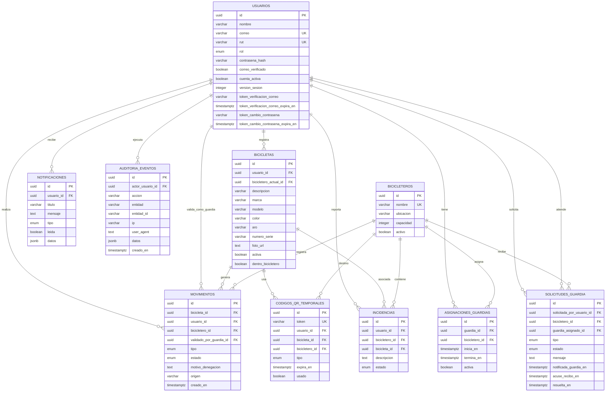

# Modelo Relacional UBBike

Este documento resume el MR del sistema. La fuente tecnica esta en las
entidades TypeORM del backend:

- `backend/src/modulos/usuarios/usuario.entidad.ts`
- `backend/src/modulos/bicicletas/bicicleta.entidad.ts`
- `backend/src/modulos/bicicleteros/bicicletero.entidad.ts`
- `backend/src/modulos/historial/movimiento.entidad.ts`
- `backend/src/modulos/qr/codigo-qr-temporal.entidad.ts`
- `backend/src/modulos/acceso/asignacion-guardia.entidad.ts`
- `backend/src/modulos/acceso/solicitud-guardia.entidad.ts`
- `backend/src/modulos/notificaciones/notificacion.entidad.ts`
- `backend/src/modulos/incidencias/incidencia.entidad.ts`
- `backend/src/modulos/auditoria/auditoria.entidad.ts`

## Diagrama ER

## Reglas principales

- Un usuario puede tener muchas bicicletas, pero solo una deberia estar activa.
- Cada QR temporal pertenece a un usuario, una bicicleta y opcionalmente a un
  bicicletero.
- Cada movimiento guarda usuario, bicicleta, bicicletero y guardia que valida.
- El estado real de una bicicleta se guarda en `dentro_bicicletero` y
  `bicicletero_actual_id`.
- Las solicitudes de guardia registran quien pidio ayuda, en que bicicletero,
  que guardia fue asignado y el estado de atencion.
- Los eventos criticos quedan registrados en `auditoria_eventos` para trazabilidad
  operativa y revision posterior.
