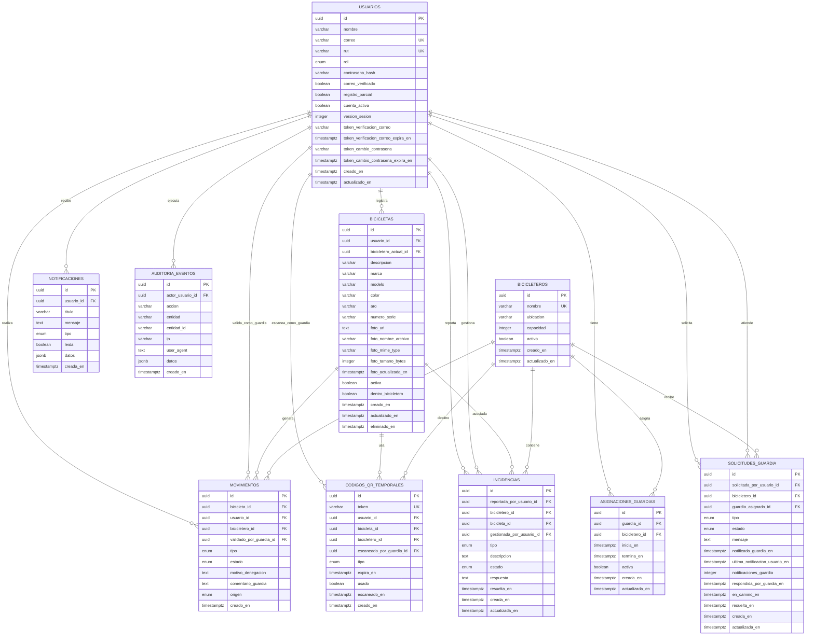

# Modelo Relacional UBBike

Este documento resume el MR del sistema. La fuente técnica del esquema está en
`backend/prisma/schema.prisma`, con migraciones versionadas en
`backend/prisma/migrations`.

## Diagrama ER



## Reglas Principales

- Un usuario puede tener muchas bicicletas, pero solo una debe estar activa. La
  base de datos refuerza esta regla con un índice único parcial sobre
  `usuario_id` cuando `activa = true` y `eliminado_en IS NULL`.
- Cada QR temporal pertenece a un usuario, una bicicleta y opcionalmente a un
  bicicletero. Cuando el guardia lo escanea, se registra
  `escaneado_por_guardia_id` y `escaneado_en`.
- Cada movimiento guarda usuario, bicicleta, bicicletero y guardia que valida.
  El tipo usa `INGRESO` o `RETIRO`, y el origen usa `QR` o `MANUAL`.
- El estado real de una bicicleta se guarda en `dentro_bicicletero` y
  `bicicletero_actual_id`.
- La foto de una bicicleta se modela como atributo de `bicicletas`, porque el
  sistema requiere una sola foto principal por bicicleta. El archivo se guarda
  fuera de la base de datos y en la tabla se persisten URL y metadatos.
- Las solicitudes de guardia registran quién pidió ayuda, en qué bicicletero,
  qué guardia fue asignado, cuántas veces se notificó, cuándo respondió el
  guardia y cuándo quedó en camino o resuelta.
- Las incidencias registran problemas operativos del bicicletero, bicicleta, QR,
  movimientos o datos de usuario. Cualquier actor autenticado puede reportar.
  Los guardias pueden ver las incidencias asociadas a su bicicletero asignado,
  pero el cambio formal de estado queda reservado a administración/central.
  Para cerrar una incidencia como `RESUELTA` o `DESCARTADA`, se debe registrar
  una respuesta de gestión.
- Los eventos críticos quedan registrados en `auditoria_eventos` para
  trazabilidad operativa y revisión posterior.

## Enumeraciones

- `RolUsuario`: `ESTUDIANTE`, `FUNCIONARIO`, `GUARDIA`, `ADMIN_CENTRAL`,
  `ADMINISTRADOR`.
- `TipoMovimiento`: `INGRESO`, `RETIRO`.
- `TipoCodigoQrTemporal`: `INGRESO`, `RETIRO`.
- `TipoOrigenMovimiento`: `QR`, `MANUAL`.
- `EstadoMovimiento`: `CONFIRMADO`, `DENEGADO`.
- `TipoSolicitudGuardia`: `GUARDIA_AUSENTE`, `REQUIERE_SERVICIO`.
- `EstadoSolicitudGuardia`: `PENDIENTE`, `NOTIFICADA`, `EN_CAMINO`,
  `RESUELTA`, `CANCELADA`.
- `TipoIncidencia`: `PROBLEMA_QR`, `DANO_BICICLETA`, `DANO_INFRAESTRUCTURA`,
  `PROBLEMA_MOVIMIENTO`, `USUARIO_DATOS`, `OTRO`.
- `EstadoIncidencia`: `PENDIENTE`, `EN_REVISION`, `RESUELTA`, `DESCARTADA`.
- `TipoNotificacion`: `SISTEMA`, `CUENTA`, `SEGURIDAD`, `SOLICITUD_GUARDIA`,
  `MOVIMIENTO`, `INCIDENCIA`.

## Generación Automática Del Diagrama

El archivo `docs/modelo-relacional.dbml` se genera automáticamente desde
`backend/prisma/schema.prisma` mediante `prisma-dbml-generator`. Este archivo no
debe editarse manualmente, porque representa el modelo actual definido en
Prisma.

Para regenerar el diagrama:

```bash
cd backend
npm run generate
```

Luego se puede abrir `docs/modelo-relacional.dbml` con una extensión DBML en VS
Code o pegar su contenido en `https://dbdiagram.io/` para exportarlo como imagen
o PDF e incluirlo en el informe.
